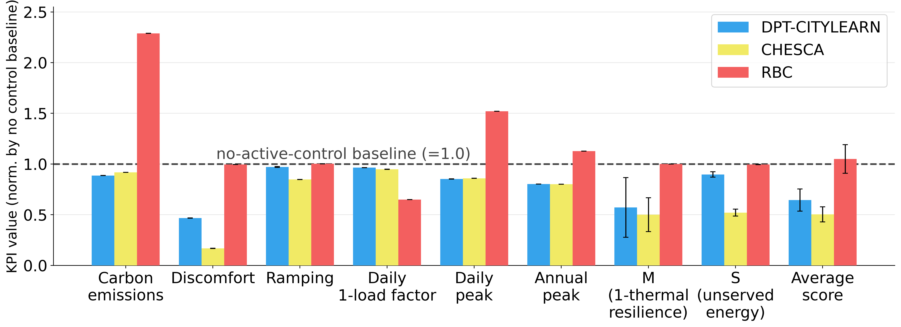
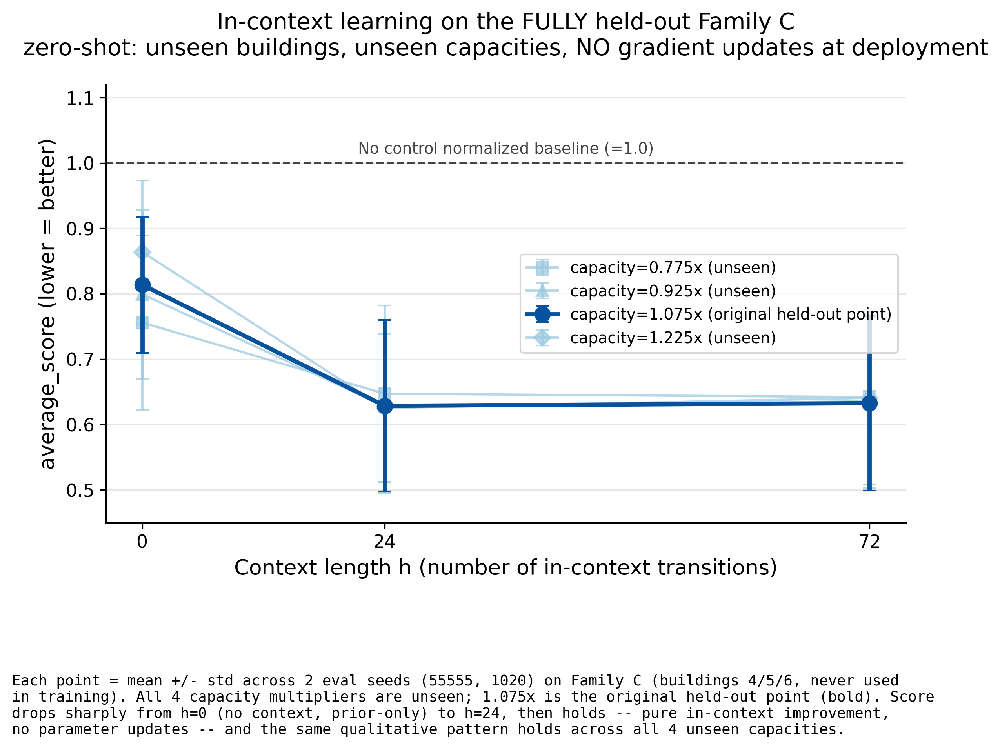
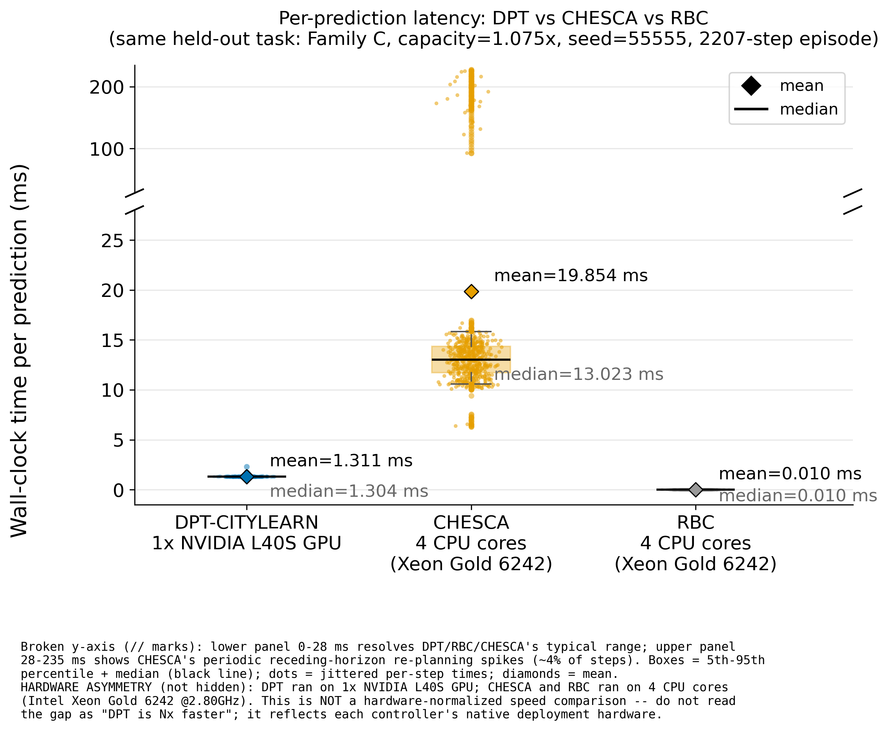

# CityLearn Universal DPT — Method, Results, Runtime

## 1. Method

**Environment.** CityLearn 2023 (Farama Gymnasium interface), `central_agent=True`: one aggregated
observation vector per district (`obs_dim=52`) and one aggregated action vector (`action_dim=9` = 3
buildings x 3 per-building actions — DHW storage, electrical/battery storage, cooling/heat-pump
power), one scalar community reward per step.

**Model.** A causal transformer (Decision-Pretrained Transformer, DPT) with **query-FIRST** token
ordering — the query token is placed before the context sequence, not after. The action head is
**discretized**, with `B=21` bins per action dimension. Training and readout use a maximum context
length `H_max=256`; the query prediction is read out by gathering the transformer's output at the
last valid context position for each example.

**Labels.** All action labels come from **CHESCA**, the winning 2023 CityLearn Challenge algorithm
(hierarchical classical optimization, not RL). CHESCA is rolled out on each task and its
`(state, action)` pairs are harvested as `(query_state, label)` targets; additional query states are
drawn from the diverse context rollouts and labeled by placing CHESCA at that state. PPO/SAC are
never used as a label source.

**Context.** The context stream mixes three sources at a fixed ratio for the operating checkpoint
(**r3**): **40% exploratory** (random + RBC rollouts), **30% CHESCA+noise**, **30% self-generated**
(greedy + sampled rollouts from the model itself). Context is drawn as a random subset and
explicitly reshuffled on every training example, so the model is trained to be order-robust rather
than exposed to one incidental ordering.

**Training budget.** The operating checkpoint was trained for **~5000 steps**. A 3x-longer run (up
to 15000 steps) was used to verify this was not undertrained: the held-out score change from 5000 to
15000 steps stayed within ~0.02, the established GPU-noise floor — i.e. the score had **plateaued**.

**Trained on (10 tasks, fixed N=3):** 2 anchor building/weather families —
Family A (`citylearn_challenge_2023_phase_1`) and Family B
(`citylearn_challenge_2023_phase_2_online_evaluation_1`) — each combined with 5 capacity
multipliers (0.7, 0.85, 1.0, 1.15, 1.3x; battery/DHW/heat-pump capacity and nominal power co-scaled
to preserve action bounds). Building count is fixed at N=3 per task; only which physical
buildings/parameters fill the 3 slots varies.

**Evaluated on (zero-shot):** Family C (`citylearn_challenge_2023_phase_3_1`, buildings 4/5/6) — an
anchor family checksum-verified as genuinely distinct from A and B, never touched during training —
at capacity multipliers (0.775, 0.925, 1.075, 1.225x), all interior to but excluded from the
training capacity grid. **No gradient updates are performed at evaluation time**; all adaptation is
by conditioning on accumulated context.

**Operating point.** Four context mix ratios were trained and compared on a wider held-out capacity
sweep: r1 (60/20/20), r2 (50/25/25), r3 (40/30/30), r4 (25/37.5/37.5) as
exploratory/CHESCA-noisy/self-play percentages. r2, r3, and r4 landed within ~0.02 of each other on
that sweep — within the established noise floor, i.e. statistically indistinguishable. r3 was
retained as the nominal operating point (best mean on the wider sweep), not as a decisively superior
configuration.

## 2. Results

All KPIs below are RBC-normalized (official CityLearn 8-KPI convention; lower is better, ~1.0 = no
gain over RBC), evaluated on the held-out Family C task (capacity=1.075x), mean ± std across 3 eval
seeds (55555, 1020, 1025).

**Expert-competitive on energy/grid-shape KPIs, zero-shot on unseen buildings, no gradient updates:**
- Carbon emissions: DPT-CITYLEARN **0.886** vs CHESCA 0.918 (DPT ahead) vs RBC 2.289.
- Daily peak: 0.852 vs 0.859 (comparable).
- Annual peak: 0.803 vs 0.801 (comparable).
- Daily 1-load factor: 0.964 vs 0.948 (comparable).
- Ramping: 0.971 vs 0.848 — DPT trails CHESCA here.

**Clear gap vs CHESCA on comfort and outage-conditional unserved energy:**
- Discomfort: DPT 0.467 vs CHESCA 0.168 — a real gap, though still far ahead of RBC (0.996).
- S (unserved energy): DPT 0.897 vs CHESCA 0.521 — also a real gap, again ahead of RBC (0.996).

**M (1-thermal resilience): DPT 0.572±0.294 vs CHESCA 0.500±0.167 vs RBC 1.000.** Both error bars
are large. M and S are computed from only 2 outage seeds, and one of those two seeds produced **zero
outage steps** for this task — the resilience comparison is limited by this sample size and should
not be read as a settled result either way.

**Average score: DPT 0.645±0.109 vs CHESCA 0.504±0.074 vs RBC 1.050±0.141.** This composite blends
the KPIs where DPT is expert-competitive with the KPIs where it clearly lags; it should not be read
as "DPT matches CHESCA" — the per-KPI breakdown above is the honest picture.

**Hero result — in-context learning on the fully held-out family:**

average_score improves sharply from context alone: at the original held-out point
(capacity=1.075x), score goes from **0.814** at h=0 (no context, prior-only) to **0.629** at h=24
and holds through h=72 — a pure in-context effect, with **no parameter updates**. The same
qualitative pattern (sharp drop, then plateau) holds across all 4 unseen capacity multipliers
tested (0.775, 0.925, 1.075, 1.225x), not just the original held-out point, on buildings never seen
during training.

## 3. Runtime

DPT-CITYLEARN's real-episode per-prediction cost is **~1.3 ms** (mean 1.311 ms, std 0.036 ms) on
**1x NVIDIA L40S GPU**, and stays low and near-constant across context length — 1.061 ms at h=0 to
1.149 ms at h=256, only ~8% growth over the full trained context range.

CHESCA's per-prediction cost is higher and **bursty** on **4 CPU cores (Intel Xeon Gold 6242
@2.80GHz)**: median 13.0 ms, mean 19.854 ms (std 34.212 ms) — the large gap between mean and median
is because ~4% of steps spike past 200 ms (max 227.8 ms), from CHESCA's periodic receding-horizon
re-planning solve, not a constant per-step cost. RBC is a trivial rule lookup (~0.01 ms/prediction).

**Hardware asymmetry, stated explicitly:** the DPT numbers are measured on GPU; the CHESCA/RBC
numbers are measured on CPU. This is **not a hardware-normalized speed comparison** and should not
be read as a raw speed claim. The comparison that holds regardless of hardware is qualitative: DPT
is a fixed, predictable, cheap forward pass at deployment, while CHESCA is an online optimization
that must be re-solved every decision, on every task, forever — including occasional expensive
re-plans.
